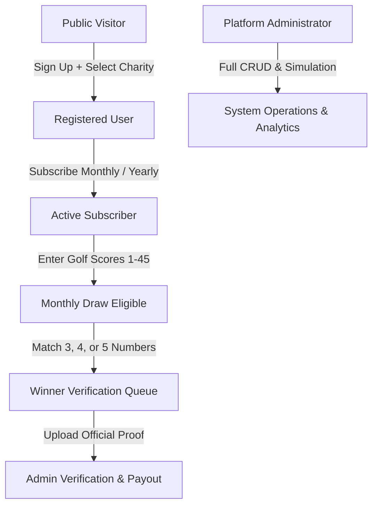
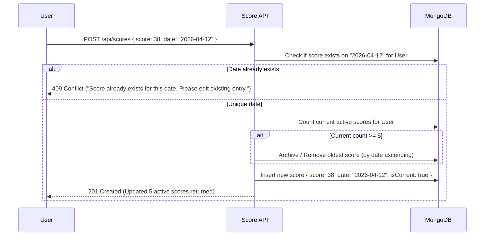
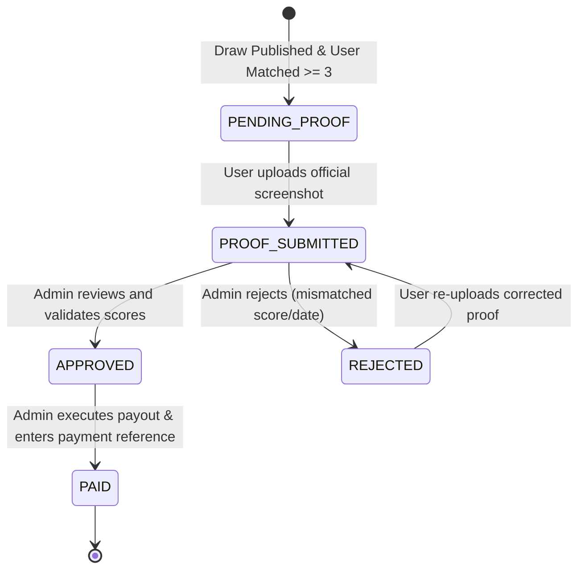

# digital.HEROES — Complete Project Blueprint & Architecture Specification
**Document Version:** 1.0 (March 2026 Edition)  
**Classification:** Core System Blueprint for Engineering & AI Agents  
**Source Truth:** *Digital Heroes PRD (Level 1) — 2026 Edition*

---

## 1. Executive Vision & Core Philosophy

### 1.1 The Platform Concept
**digital.HEROES** is a subscription-driven web platform that integrates:
1. **Golf Performance Tracking**: A streamlined 5-score rolling handicap tracker using the international Stableford scoring format (range 1–45).
2. **Charitable Impact Engine**: A giving ecosystem where every subscriber directs at least 10% (with voluntary up-scaling and direct donations) of their recurring fee to a verified charity of their choice.
3. **Monthly Draw-Based Reward Engine**: A transparent, tiered prize lottery (5-number, 4-number, and 3-number matches) funded directly by subscription pools, featuring jackpot rollovers and dual draw algorithms (Standard Random vs. Score-Frequency Algorithmic).

### 1.2 "Feel, Not Fairway" Design Philosophy
Traditional golf websites rely on clichés: fairway photography, argyle/plaid patterns, golf carts, and club imagery. **digital.HEROES strictly rejects this aesthetic.**
- **Lead with Emotion & Giving**: The interface must feel like a modern, high-tech fintech/philanthropy hybrid—sleek, dark-mode elevated, fluid micro-interactions, glassmorphism, and bold typographic hierarchy.
- **Micro-Interactions**: Ambient glowing counters for prize pools, dynamic celebration particle effects for draws, smooth animated tickers for charity funds raised, and seamless score slot transitions.
- **Conversion-Driven**: High-converting subscription funnels with clear prize transparency and impact visualization.

---

## 2. System Actors & Role-Based Access Control (RBAC)

The system enforces three strictly bounded security roles:



### Role 1: Public Visitor (Anonymous)
- **Access Boundary**: Public marketing pages, charity discovery directory, draw mechanics explanation, public past draw results, terms & legal disclaimers.
- **Actions**:
  - Browse featured and directory charities with search & category filters.
  - View upcoming draw jackpot counter and past winning numbers.
  - Initiate registration & onboarding flow.

### Role 2: Registered Subscriber (Authenticated + Active Status)
- **Access Boundary**: Personal dashboard, score management system, draw participation records, winnings portal, charity allocation settings.
- **Access Enforcement**: Real-time subscription check (`status === 'active' | 'trialing'`) evaluated on every authenticated request. Inactive/lapsed users are redirected to a reactivation paywall.
- **Actions**:
  - Manage profile, payment methods, and subscription tier (Monthly vs. Yearly).
  - Select recipient charity from directory; adjust contribution percentage (minimum 10% up to 100%).
  - Enter, update, and manage golf scores (maximum 5, FIFO rolling queue, Stableford 1–45, strictly 1 score per date).
  - Track monthly draw participation status and active draw ticket (the 5 active scores).
  - View winnings history, submit official score proof screenshots for validation, and track payout status (`PENDING_PROOF` → `PROOF_SUBMITTED` → `APPROVED` → `PAID`).
  - Make one-off direct charitable donations (not tied to draws).

### Role 3: Platform Administrator (Admin Role)
- **Access Boundary**: `/admin/*` control plane, backend management APIs, audit logs.
- **Actions**:
  - **User Management**: View subscriber roster, inspect score histories, override/correct scores, toggle account status.
  - **Draw Management**: Select draw algorithm (Random vs. Score Frequency), trigger simulations, review simulated winners/payouts, publish official draw results, track jackpot rollover balances.
  - **Charity Management**: CRUD charities (name, description, logo, banner, categories, cause stats, upcoming events like charity golf days).
  - **Winner Verification & Payouts**: Review submitted proof screenshots vs. registered scores, approve or reject with reason, mark payouts as completed with reference IDs.
  - **Reports & Analytics**: Real-time aggregates of subscriber ARR/MRR, total charitable funds distributed, total prize pools paid out, draw frequency statistics.

---

## 3. Core Engine Specifications & Business Rules

### 3.1 Score Management Engine (Stableford 1–45)
The platform uses the **Stableford** scoring format, standard across international golf:
- **Valid Score Range**: Integers between `1` and `45` (inclusive). Scores `< 1` or `> 45` are rejected with HTTP 422.
- **Capacity**: The system stores **exactly up to 5 scores** per user for draw participation.
- **Rolling FIFO Lifecycle**:
  - If a user has fewer than 5 scores, new scores fill empty slots.
  - Once 5 scores exist, entering a new score automatically drops the **oldest stored score by round date** (FIFO - First In, First Out).
- **Date Constraint**: **Strictly ONE score per date**.
  - Duplicate submissions for the same date are rejected (HTTP 409 Conflict).
  - Users may edit or delete an existing score for that date, but cannot insert a second round on the same date.
- **Ordering**: Scores are always retrieved and presented in **reverse chronological order** (most recent round date first).



---

### 3.2 Subscription & Financial Architecture

#### Subscription Plans
1. **Monthly Plan**: Standard recurring rate (e.g., $25/month).
2. **Yearly Plan**: Discounted annual rate (e.g., $240/year = $20/month equivalent).

#### Fee Decomposition Model
Every subscription dollar is mathematically distributed across three pools:
$$\text{Subscription Fee} = \text{Charity Allocation} + \text{Prize Pool Contribution} + \text{Platform Operations}$$

1. **Charity Allocation**:
   - **Default Minimum**: 10% of gross subscription.
   - **Voluntary Setting**: The subscriber can voluntarily increase their percentage (e.g. 15%, 25%, 50%, or 100%) via a slider in their dashboard.
2. **Prize Pool Contribution**:
   - A deterministic fixed percentage of active subscriptions funds the monthly prize pool (e.g., 50% of base subscription fee).
   - Monthly Prize Pool Base ($P_{\text{base}}$):
     $$P_{\text{base}} = \sum_{u \in \text{Active Subscribers}} (\text{Monthly Equivalent Fee}_u \times \text{Prize Contribution Rate})$$
3. **Direct Donations**:
   - 100% of standalone donations are directed to the designated charity (minus 3rd-party payment processing fees). Standalone donations do not grant draw tickets.

---

### 3.3 Draw & Reward Engine

#### Draw Frequency & Cadence
- Draws execute on a **monthly cadence** (e.g., 1st day of every month for the preceding month).
- Admin publishes the draw via the Admin Control Surface.

#### Draw Algorithms
Admin can choose between two mathematical modes when configuring a draw:

1. **Mode A: Random (Standard Lottery Style)**:
   - Draws 5 unique integers uniformly sampled from the discrete interval $[1, 45]$:
     $$\text{Drawn Numbers} = \text{SampleWithoutReplacement}(\{1, 2, \dots, 45\}, 5)$$
2. **Mode B: Algorithmic (Score Frequency Weighted)**:
   - Analyzes all active scores submitted by active subscribers in the current draw period.
   - Calculates the relative frequency of each score $s \in [1, 45]$:
     $$w_s = \frac{\text{Count}(s) + \alpha}{\sum_{k=1}^{45} (\text{Count}(k) + \alpha)}$$
     *(where $\alpha$ is a Laplace smoothing factor, default = 1, ensuring non-zero probability for rare scores).*
   - Draws 5 unique numbers based on this probability distribution.

#### Prize Pool Distribution & Rollover Mechanics
The total monthly prize pool ($P_{\text{total}}$) is calculated as:
$$P_{\text{total}} = P_{\text{base}} + J_{\text{rollover\_in}}$$
*(where $J_{\text{rollover\_in}}$ is the unclaimed 5-match jackpot from the previous month).*

The pool is split strictly across three winning tiers:

| Tier | Match Criteria | Pool Share | Rollover Behavior | Winner Distribution |
| :--- | :--- | :---: | :---: | :--- |
| **Tier 1 (Jackpot)** | **5-Number Match** | **40%** | **YES** | Split equally among all 5-match winners. If 0 winners, **100% of this 40% rolls over** to next month's Tier 1 pool ($J_{\text{rollover\_out}}$). |
| **Tier 2** | **4-Number Match** | **35%** | **NO** | Split equally among all 4-match winners. If 0 winners, funds remain in platform reserve or boost next draw. |
| **Tier 3** | **3-Number Match** | **25%** | **NO** | Split equally among all 3-match winners. If 0 winners, funds remain in platform reserve. |

*Example Calculation*:
- Total pool for Month = $10,000 (including $2,000 rollover from previous month).
- Tier 1 (40%): $4,000.
  - If 2 winners: each receives $2,000.
  - If 0 winners: $4,000 rolls over to next month's jackpot ($J_{\text{rollover\_out}} = \$4,000$).
- Tier 2 (35%): $3,500.
  - If 5 winners: each receives $700.
- Tier 3 (25%): $2,500.
  - If 50 winners: each receives $50.

#### Admin Draw Simulation Workflow
To eliminate human error or catastrophic miscalculations:
1. Admin opens `/admin/draws/new`.
2. Admin selects algorithm (**Random** or **Score Frequency**).
3. Admin clicks **"Run Simulation"**:
   - Backend evaluates active subscribers and their 5 active scores.
   - Simulates the draw numbers.
   - Calculates exact matching subscribers across 5, 4, and 3 matches.
   - Displays simulated payouts per winner, total payout, and rollover calculation.
4. Admin can re-simulate or, once satisfied, click **"Confirm & Publish Official Draw"**:
   - Immutably commits draw record to database.
   - Creates `Winner` records in `PENDING_PROOF` status.
   - Sends notification / email alerts to winning subscribers.

---

### 3.4 Winner Verification & Payout Lifecycle

Because this is an official prize draw with real money, winner verification is strictly enforced:
- **Eligibility**: Verification applies **only to winners** who have matched 3, 4, or 5 numbers in a published draw.
- **Proof Requirement**: Winner must upload a screenshot of their official golf platform score history (e.g. Golf Australia, USGA GHIN, WHS, HowDidiDo) confirming the rounds and dates entered.



---

## 4. Complete Database Schema (MongoDB / Mongoose)

Below is the definitive schema specification for MongoDB Atlas using Mongoose.

```
                    ┌─────────────────┐
                    │      User       │
                    └────────┬────────┘
                             │ 1:N
            ┌────────────────┼────────────────┬────────────────┐
            │ 1:N            │ 1:N            │ 1:N            │ 1:1 (ref)
            ▼                ▼                ▼                ▼
     ┌─────────────┐  ┌─────────────┐  ┌─────────────┐  ┌─────────────┐
     │    Score    │  │ Subscription│  │  Donation   │  │   Charity   │
     └─────────────┘  └─────────────┘  └─────────────┘  └─────────────┘
                             │
                             ▼
                    ┌─────────────────┐
                    │      Draw       │
                    └────────┬────────┘
                             │ 1:N
                             ▼
                    ┌─────────────────┐
                    │     Winner      │
                    └─────────────────┘
```

### 4.1 Users Collection (`User`)
```javascript
{
  _id: ObjectId,
  email: { type: String, required: true, unique: true, lowercase: true, index: true },
  passwordHash: { type: String, required: true },
  firstName: { type: String, required: true },
  lastName: { type: String, required: true },
  role: { type: String, enum: ['user', 'admin'], default: 'user', index: true },
  
  // Subscription state
  subscriptionStatus: { 
    type: String, 
    enum: ['none', 'trialing', 'active', 'past_due', 'canceled', 'lapsed'], 
    default: 'none',
    index: true 
  },
  subscriptionPlan: { type: String, enum: ['monthly', 'yearly', null], default: null },
  stripeCustomerId: { type: String, default: null, index: true },
  stripeSubscriptionId: { type: String, default: null },
  subscriptionRenewalDate: { type: Date, default: null },

  // Charity preference
  selectedCharityId: { type: ObjectId, ref: 'Charity', default: null },
  charityContributionPercent: { type: Number, min: 10, max: 100, default: 10 },

  // Golf handicap metadata
  handicapIndex: { type: Number, default: null },
  homeClub: { type: String, default: null },

  createdAt: { type: Date, default: Date.now },
  updatedAt: { type: Date, default: Date.now }
}
```

### 4.2 Scores Collection (`Score`)
```javascript
{
  _id: ObjectId,
  userId: { type: ObjectId, ref: 'User', required: true, index: true },
  score: { type: Number, required: true, min: 1, max: 45 },
  date: { type: Date, required: true, index: true }, // Round date (YYYY-MM-DD)
  courseName: { type: String, default: 'Unspecified Course' },
  isCurrentActive: { type: Boolean, default: true, index: true }, // Part of user's active 5
  archivedAt: { type: Date, default: null },
  createdAt: { type: Date, default: Date.now }
}
// Compound unique index: Only 1 score per date per user
ScoreSchema.index({ userId: 1, date: 1 }, { unique: true });
// Compound index for active draw pool querying
ScoreSchema.index({ userId: 1, isCurrentActive: 1, date: -1 });
```

### 4.3 Charities Collection (`Charity`)
```javascript
{
  _id: ObjectId,
  name: { type: String, required: true, unique: true },
  slug: { type: String, required: true, unique: true, index: true },
  tagline: { type: String, required: true },
  description: { type: String, required: true },
  category: { 
    type: String, 
    enum: ['Healthcare', 'Youth & Education', 'Veterans', 'Environment', 'Disaster Relief', 'Community'],
    required: true,
    index: true
  },
  logoUrl: { type: String, required: true },
  bannerUrl: { type: String, required: true },
  websiteUrl: { type: String, default: '' },
  totalFundsRaised: { type: Number, default: 0 },
  supporterCount: { type: Number, default: 0 },
  isFeatured: { type: Boolean, default: false, index: true },
  isActive: { type: Boolean, default: true, index: true },
  
  // Upcoming events (e.g. Charity Golf Days)
  events: [
    {
      title: { type: String, required: true },
      date: { type: Date, required: true },
      location: { type: String, required: true },
      description: { type: String, default: '' },
      registrationUrl: { type: String, default: '' }
    }
  ],
  createdAt: { type: Date, default: Date.now },
  updatedAt: { type: Date, default: Date.now }
}
```

### 4.4 Draws Collection (`Draw`)
```javascript
{
  _id: ObjectId,
  drawNumber: { type: Number, required: true, unique: true, index: true }, // e.g. 101
  drawMonth: { type: String, required: true, index: true }, // e.g. "2026-03"
  drawDate: { type: Date, required: true },
  
  algorithmType: { type: String, enum: ['random', 'frequency_weighted'], required: true },
  status: { type: String, enum: ['draft_simulation', 'published'], default: 'draft_simulation', index: true },
  
  drawnNumbers: [{ type: Number, min: 1, max: 45 }], // Exactly 5 unique numbers
  
  // Financial Snapshot at draw execution
  activeSubscribersCount: { type: Number, required: true },
  basePrizePool: { type: Number, required: true },
  jackpotRolloverIn: { type: Number, default: 0 },
  totalPrizePool: { type: Number, required: true },
  
  // Tier breakdown
  tier1Pool: { type: Number, required: true }, // 40%
  tier2Pool: { type: Number, required: true }, // 35%
  tier3Pool: { type: Number, required: true }, // 25%
  
  // Results summary
  tier1WinnersCount: { type: Number, default: 0 },
  tier2WinnersCount: { type: Number, default: 0 },
  tier3WinnersCount: { type: Number, default: 0 },
  
  tier1PayoutPerWinner: { type: Number, default: 0 },
  tier2PayoutPerWinner: { type: Number, default: 0 },
  tier3PayoutPerWinner: { type: Number, default: 0 },
  
  jackpotRolloverOut: { type: Number, default: 0 }, // If 0 tier 1 winners, rolls to next draw
  
  publishedBy: { type: ObjectId, ref: 'User' },
  publishedAt: { type: Date, default: null },
  createdAt: { type: Date, default: Date.now }
}
```

### 4.5 Winners Collection (`Winner`)
```javascript
{
  _id: ObjectId,
  drawId: { type: ObjectId, ref: 'Draw', required: true, index: true },
  userId: { type: ObjectId, ref: 'User', required: true, index: true },
  tier: { type: String, enum: ['tier_1_five_match', 'tier_2_four_match', 'tier_3_three_match'], required: true },
  matchCount: { type: Number, required: true, min: 3, max: 5 },
  matchedNumbers: [{ type: Number }],
  userSubmittedScores: [{ score: Number, date: Date }],
  prizeAmount: { type: Number, required: true },
  
  // Verification State Machine
  verificationStatus: { 
    type: String, 
    enum: ['pending_proof', 'proof_submitted', 'approved', 'rejected'], 
    default: 'pending_proof',
    index: true 
  },
  proofScreenshotUrl: { type: String, default: null },
  proofSubmittedAt: { type: Date, default: null },
  reviewedBy: { type: ObjectId, ref: 'User', default: null },
  reviewedAt: { type: Date, default: null },
  rejectionReason: { type: String, default: null },
  
  // Payout State Machine
  payoutStatus: { 
    type: String, 
    enum: ['unpaid', 'processing', 'paid'], 
    default: 'unpaid',
    index: true 
  },
  payoutMethod: { type: String, default: null },
  payoutReference: { type: String, default: null },
  paidAt: { type: Date, default: null },
  
  createdAt: { type: Date, default: Date.now }
}
```

### 4.6 Direct Donations Collection (`Donation`)
```javascript
{
  _id: ObjectId,
  userId: { type: ObjectId, ref: 'User', default: null, index: true }, // Optional if guest
  charityId: { type: ObjectId, ref: 'Charity', required: true, index: true },
  amount: { type: Number, required: true, min: 1 },
  donorName: { type: String, default: 'Anonymous' },
  donorEmail: { type: String, required: true },
  stripePaymentIntentId: { type: String, required: true, unique: true },
  paymentStatus: { type: String, enum: ['pending', 'succeeded', 'failed'], default: 'pending' },
  message: { type: String, default: '' },
  createdAt: { type: Date, default: Date.now }
}
```

---

## 5. Security Architecture & Middleware Guards

### 5.1 Authentication Strategy
- **Token Delivery**: HttpOnly, SameSite, Secure JWT cookie containing `{ userId, role, subStatus }`.
- **Stateless Verification with Real-Time Re-Check**: Critical operations (e.g. Draw simulation, score entry, winner payout approval) perform a cached DB re-check to ensure subscription or admin role has not been revoked.

### 5.2 Access Control Matrix
| Resource Route | Public | Subscriber (Active) | Subscriber (Inactive) | Admin |
| :--- | :---: | :---: | :---: | :---: |
| `/` (Homepage) | Read | Read | Read | Read |
| `/charities/*` | Read | Read | Read | Read / CRUD |
| `/api/scores` | Denied | Read / Write | Denied (Paywall) | Read / Admin Override |
| `/dashboard/*` | Redirect Login | Full Access | Paywall Redirect | Full Access |
| `/admin/*` | 403 Forbidden | 403 Forbidden | 403 Forbidden | Full Access |
| `/api/admin/*` | 401/403 | 403 Forbidden | 403 Forbidden | Full Access |

---

## 6. Implementation Phasing & Milestones

1. **Phase 1 — Core Foundation & Database Connectivity**
   - Mongoose models compilation, validation schemas, seed data (Sample Charities, Admin Account, Mock Scores).
   - Global layout with "Feel, not Fairway" design system, brand colors, typography, and responsive navigation.
2. **Phase 2 — Authentication & Subscription Engine**
   - User registration with initial charity selection.
   - JWT Auth session management.
   - Subscription checkout mock / Stripe integration (Monthly vs. Yearly).
   - Middleware guard for active subscriber validation.
3. **Phase 3 — Score Management Engine (Stableford 1-45)**
   - 5-score rolling FIFO algorithm implementation.
   - Unique date validation and error handling.
   - Interactive score entry UI with real-time slot animations.
4. **Phase 4 — Charity Discovery & Direct Giving**
   - Charity directory with search and category filtering.
   - Detailed charity profile page with impact metrics and event schedule.
   - Charity allocation slider in subscriber dashboard.
   - Direct donation checkout modal.
5. **Phase 5 — Draw Engine & Admin Simulation Control**
   - Random draw generator & Score-Frequency Algorithmic generator.
   - Admin Draw Simulator UI with live payout preview.
   - Draw publisher with prize tier calculations and rollover accumulation.
6. **Phase 6 — Winner Verification & Payout Pipeline**
   - Winner notification banners on user dashboard.
   - Proof upload interface for winners (screenshot submission).
   - Admin review queue (inspect proof, approve/reject, mark paid).
7. **Phase 7 — Admin Analytics & Polishing**
   - Executive analytics dashboard (MRR, charity totals, jackpot status, draw history).
   - Comprehensive error handling, responsive audit, performance optimization.
